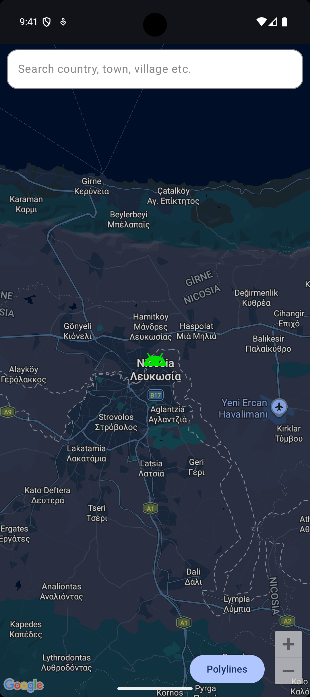
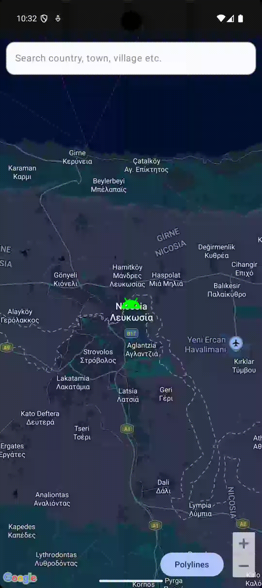

# Map Compose Showcase

[](https://linktr.ee/nicos_nicolaou)
[](https://nicosnicolaou16.github.io/)
[](https://twitter.com/nicolaou_nicos)
[](https://linkedin.com/in/nicos-nicolaou-a16720aa)
[](https://medium.com/@nicosnicolaou)
[](https://androiddev.social/@nicolaou_nicos)
[](https://bsky.app/profile/nicolaounicos.bsky.social)
[](https://dev.to/nicosnicolaou16)
[](https://www.youtube.com/@nicosnicolaou16)
[](https://g.dev/nicolaou_nicos)

A modern Android application showcasing the integration of **Google Maps** with **Jetpack Compose**. This project demonstrates advanced mapping features, a clean **MVVM** architecture, and Unidirectional Data Flow (UDF) for a robust and maintainable codebase.

## ✨ Features

* **Google Maps Compose:** Leverages the latest [Maps Compose](https://github.com/googlemaps/android-maps-compose) library for a declarative map implementation.
* **Location Search:** Integrated search functionality to find countries, towns, villages, and more via the **Geocoder API**.
* **Dynamic Custom Markers:** Demonstrates how to programmatically convert vector drawables into custom map markers with dynamic tinting and scaling.
* **Animated Polylines:** Visualizes routes by drawing and animating polylines between coordinates, simulating real-time movement.
* **Reverse Geocoding:** Automatically fetches and displays the location name when selecting points on the map.
* **State Management:** Implements **UDF** with dedicated **States**, **Actions**, and **Events** for predictable UI behavior and side-effect handling.
* **Modern UI:** Built entirely with **Jetpack Compose** and **Material 3**.

## 🚀 Getting Started

To get this project running locally, you'll need to set up your Google Maps API Key:

1.  Obtain an API key from the [Google Cloud Console](https://console.cloud.google.com/).
2.  Enable the **Maps SDK for Android**.
3.  In your project's root directory, create (or open) the `local.properties` file.
4.  Add your API key as follows:
    ```properties
    MAPS_API_KEY=YOUR_API_KEY_HERE
    ```

### ⚙️ Gradle & Manifest Configuration

The project is configured to automatically read the API key and inject it into the Android Manifest.

1.  **Read API Key in `app/build.gradle.kts`**:
    ```kotlin
    val localProperties = Properties()
    val localPropertiesFile = rootProject.file("local.properties")
    if (localPropertiesFile.exists()) {
        localProperties.load(localPropertiesFile.inputStream())
    }
    val mapsKey = localProperties.getProperty("MAPS_API_KEY") ?: ""

    android {
        defaultConfig {
            // ...
            manifestPlaceholders["MAPS_API_KEY"] = mapsKey
        }
    }
    ```

2.  **Inject into `AndroidManifest.xml`**:
    ```xml
    <meta-data
        android:name="com.google.android.geo.API_KEY"
        android:value="${MAPS_API_KEY}" />
    ```

## 📸 Screenshots & Demos

<p align="left">
  
  
  
  
</p>

## 🛠️ Tech Stack & Libraries

This project is built with **[Kotlin](https://kotlinlang.org/docs/getting-started.html)** and utilizes modern Android libraries:

- **UI:** [Jetpack Compose](https://developer.android.com/develop/ui/compose), [Material 3](https://m3.material.io/)
- **Map:** [Google Maps Compose](https://github.com/googlemaps/android-maps-compose)
- **Architecture:** [MVVM](https://developer.android.com/topic/architecture#recommended-app-arch) + [Unidirectional Data Flow (UDF)](https://developer.android.com/topic/architecture/ui-layer#udf)
- **Asynchronicity:** [Kotlin Coroutines](https://kotlinlang.org/docs/coroutines-overview.html), [Kotlin Flow](https://kotlinlang.org/docs/flow.html)
- **Dependency Injection:** [Hilt](https://dagger.dev/hilt/)
- **Build & Optimization:** [KSP](https://developer.android.com/build/migrate-to-ksp), [Version Catalogs](https://developer.android.com/build/migrate-to-catalogs)

## 🔧 Versioning

- **Google Maps Version:** **8.3.1**
- **Target SDK:** **37**
- **Minimum SDK:** **28**
- **Kotlin Version:** **2.4.0**
- **Gradle Version:** **9.2.1**

## 📚 References

### Data Sources & Tools

- **Google Maps SDK:** [Google Maps Platform](https://developers.google.com/maps/documentation/android-sdk/overview)
- **Geocoder:** [Android Geocoder API](https://developer.android.com/reference/android/location/Geocoder)

### Inspiration & Resources

- **Maps Compose Library:** [Official GitHub Repo](https://github.com/googlemaps/android-maps-compose)
- **UDF in Compose:** [Architecting your Compose UI](https://developer.android.com/develop/ui/compose/architecture)

## ⭐ Stargazers

If you find this project useful, please give it a star!
Check out all the stargazers here: [Stargazers on GitHub](https://github.com/NicosNicolaou16/Map-Compose-Showcase/stargazers)

## 🙏 Support & Contributions

This project is open for feedback and contributions. If you find a bug or have a feature request, please **open an issue** or submit a **pull request**.